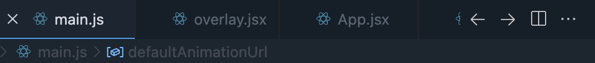

# Tab History Buttons



An extension for Visual Studio Code that adds back and forward buttons to the editor tab bar. This is useful when you want to hide the Command Center and save vertical space in the editor window.

## Contributing
To contribute, run:
```
npm install
```
Then press F5 in VS Code to launch the Extension Development Host

## Package
- npm run package
